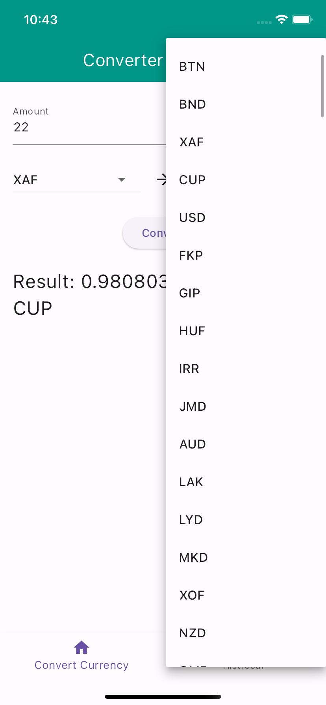

# taske_bloc_converte

A new Flutter project.

## Getting Started

# Overview

This Flutter application is a currency converter that allows users to convert between various currencies. It utilizes modern Flutter architecture patterns, including BLoC for state management, get_it for dependency injection, and sqflite for local data storage. This architecture ensures a scalable, maintainable, and efficient application.

# Features
Currency Conversion: Convert amounts between different currencies with real-time exchange rates.
Historical Data: View historical exchange rates over a specified period.
Local Storage: Save and retrieve user preferences and historical conversion data using SQLite.
Architecture

# State Management with BLoC
The application uses the BLoC (Business Logic Component) pattern to manage state and handle business logic. BLoC helps in:

Separation of Concerns: Business logic is separated from the UI code, making it easier to maintain and test.
Reactive Programming: The UI reacts to state changes automatically, providing a dynamic and responsive user experience.
Scalability: The BLoC pattern supports complex state management scenarios, which is crucial as the application grows.
Key Components:

CurrencyConverterBloc: Manages the state of currency conversion, including user inputs and conversion results.
HistoricalDataBloc: Handles fetching and displaying historical exchange rates.
Dependency Injection with get_it
get_it is used for dependency injection, providing a clean and efficient way to manage dependencies throughout the app. Benefits include:

Simplified Object Management: Centralized registration and retrieval of services and BLoCs.
Loose Coupling: Components are less dependent on each other, promoting modularity and flexibility.
Enhanced Testability: Easily provide mock implementations of services and BLoCs for testing.
Key Services:

BaseAppClient: Handles API requests for currency conversion and historical data.
NavigationService: Manages navigation within the app.
Local Storage with sqflite
sqflite is used for local data storage, allowing the app to persist user preferences and historical conversion data. Benefits include:

Persistent Storage: Save and retrieve data locally, even when the app is offline.
Efficient Data Management: Use SQLite for structured data storage and retrieval.
